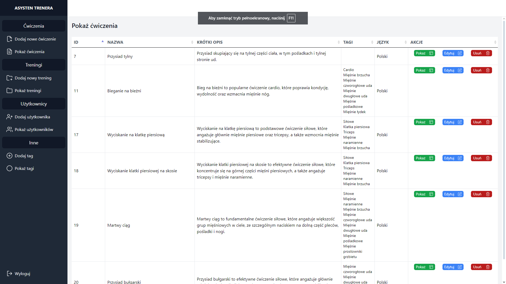
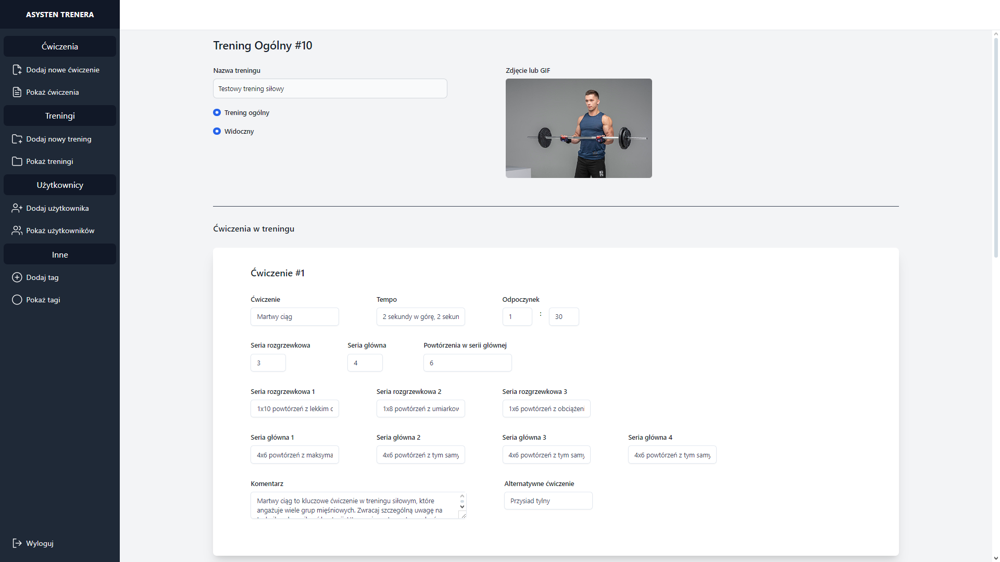
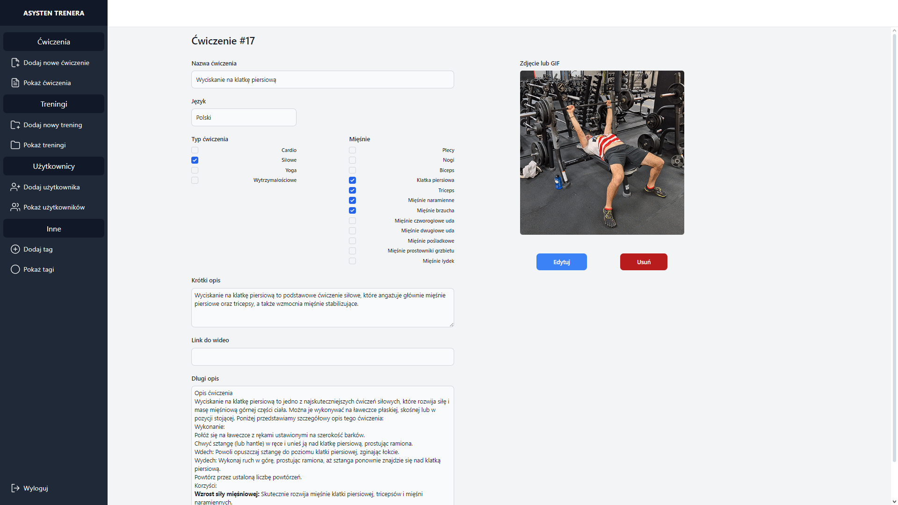

# FitnessApp Server

## Project Description

FitnessApp Server is a backend application designed for a gym workout platform, built using Django. The application allows users to add exercises, create workouts (both general and personal), manage users, manage tags, and submit workout comments. The system is built to facilitate easy database management and provide an API interface that enables communication with the frontend.

## Features

- **Add Exercises**: Users can create and manage exercises.
- **Create Workouts**: Ability to create general and personal workouts using the added exercises.
- **User Management**: Registration and management of user data.
- **Tags**: Allow tagging exercises to identify the muscles used and the type of exercise.
- **API Interface**: Enables user login, retrieving assigned workouts for the day, and access to a catalog of exercises categorized by tags.
- **Workout Comments**: Users can submit comments regarding how their workouts went, allowing for better tracking of progress and experiences.

## Technologies

The project utilizes the following technologies:

- **Django**: Web framework used for building the backend.
- **SQLite/PostgreSQL**: Databases used to store information about users, workouts, and exercises.
- **Tailwind CSS**: CSS framework for styling (while the backend application does not directly handle the frontend, Tailwind can be used in collaborating projects).

## Screenshots

<div style="display: flex; justify-content: space-between;">
    
    
    
</div>

## Installation

To run the application, follow these steps:

1. Clone the repository:
   ```bash
   git clone https://github.com/321nomyzS/FitnessApp_server.git
   cd FitnessApp_server

2. Create a virtual environment and activate it:
```bash
python -m venv venv
source venv/bin/activate  # on Unix systems
venv\Scripts\activate  # on Windows
```

3. Install the required packages:
```bash
pip install -r requirements.txt
```
Configure the database in the settings.py file

4. Run the migrations:

```bash
python manage.py migrate
```

5. Start the server:

```bash
python manage.py runserver
```

## API Usage
The application provides an API that allows for:

- User Login: An endpoint for logging in that returns an authorization token.
- Retrieving Workouts: The ability to get a list of workouts assigned to the user.
- Exercise Catalog: Access to exercises sorted by tags.
- Workout Comments: Ability to submit comments about workout performance.
